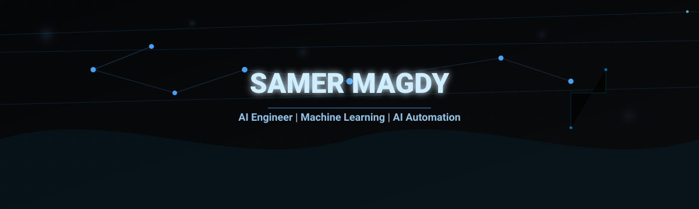

 

 

---

## About Me

I'm an AI / Machine Learning Engineer focused on building practical, intelligent solutions that solve real problems — from computer vision systems that see and understand the world, to LLM-powered agents that automate and analyze data. My work spans deep learning, computer vision, NLP, and agentic AI, with an emphasis on turning research-grade models into usable, production-ready applications.

I'm currently exploring **AI agents, Retrieval-Augmented Generation (RAG), and agentic automation workflows**, while continuing to build on a strong foundation in deep learning and computer vision.

---

## Tech Stack

**Programming Languages**

**AI & Machine Learning**

**Computer Vision**

**LLMs & AI Engineering**

**Data & Analysis**

**Tools & Development**

---

## Featured Projects

### 🚗 [Vehicle Detection and Tracking](https://github.com/samermagdy12/vechile_detection)
A real-time vehicle detection and tracking application built around a **YOLOv11** object detection model, wrapped in a **Streamlit** web interface. It supports both video streams and static images, drawing bounding boxes and confidence scores for detected vehicles in a clean, dark-themed UI.
`Python` `YOLOv11` `Streamlit`

### 🦖 [Hand Gesture Dino Game Controller](https://github.com/samermagdy12/hand-gesture-dino-game)
A hands-free controller for the Chrome Dino Game using real-time hand gesture recognition. **MediaPipe** handles hand landmark tracking, while a custom-trained **PyTorch** neural network (compared against SVC and XGBoost models) classifies gestures like "Jump" and "Walk," translating them directly into game commands.
`Python` `PyTorch` `MediaPipe` `Scikit-learn` `XGBoost`

### 🤟 [Arabic Sign Language Recognition](https://github.com/samermagdy12/sign-language)
A deep learning system for real-time recognition of sign language gestures, built primarily on a **MobileNetV2** architecture trained with **TensorFlow/Keras**. Includes multiple model checkpoints from different training phases and development notebooks covering preprocessing, training, and evaluation.
`Python` `TensorFlow` `Keras` `MobileNetV2`

### 📋 [AXA Claims Processing](https://github.com/samermagdy12/axa-claims-processing)
A full-stack capstone project for automating insurance claims processing, structured with dedicated **backend**, **frontend**, and **database** layers, plus a data pipeline and an automated test s[...]
